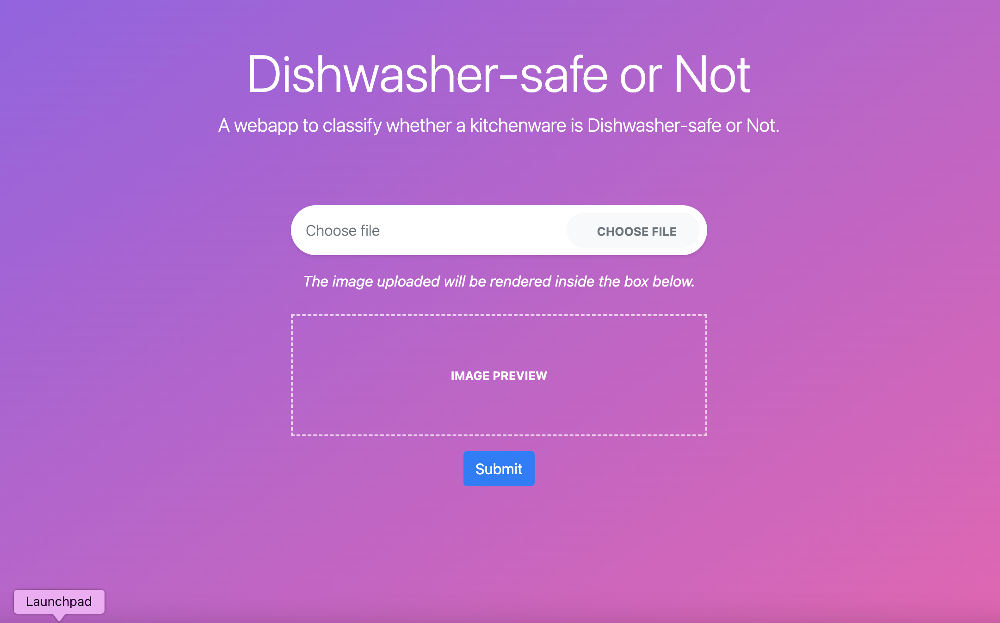

## A Flask web app that predicts whether the kitchenware in the uploaded image is dishwasher-safe or not

To start the server run the following command:
`flask --app app.py run`

### Output

Reference: [https://geekpython.in/flask-app-for-image-recognition](https://geekpython.in/flask-app-for-image-recognition)
